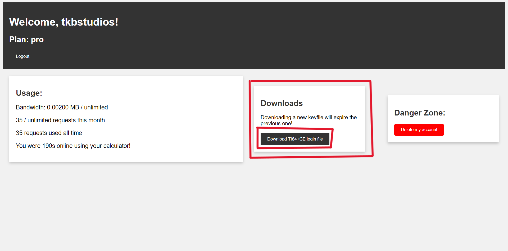
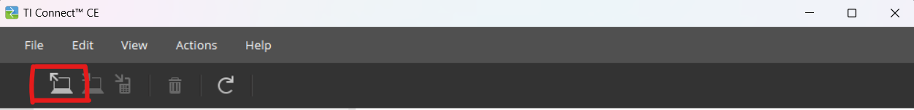
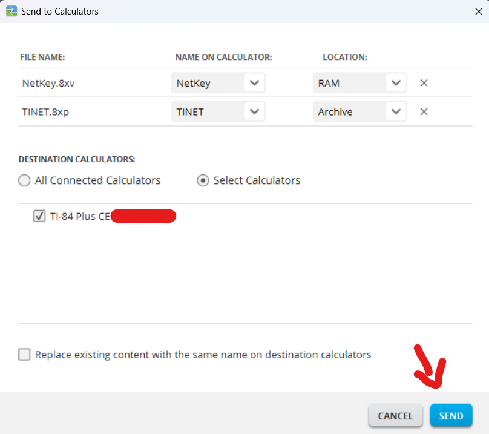
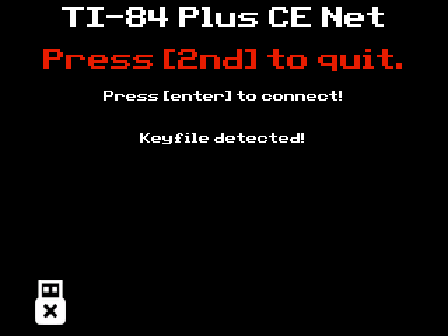
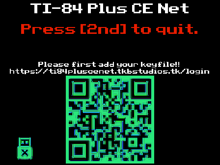

# TINET Calculator client
The official client for TINET

## How to use
1. Download the [latest client](https://github.com/tkbstudios/tinet-calc/releases/latest).  
2. Go to the [Web Dashboard](https://tinet.tkbstudios.tk/)  
3. Register or login an account.  
4. On the dashboard, download your keyfile.  

5. Open [TI Connect CE](https://education.ti.com/en/products/computer-software/ti-connect-ce-sw)  
6. Upload your downloaded keyfile on your calculator.  
  
  
7. Open the [TINET] program on your calculator.  
  
8. Press [enter] to connect!  

## What to do if it doesn't work
If you came across this screen:  
  
Then re-download your Keyfile from the [Web Dashboard](https://tinet.tkbstudios.tk/) like explained above in step 4.  
If after re-uploading your KeyFile, you still don't see the following screen, then open an issue [here](https://github.com/tkbstudios/tinet-calc/issues).  
  
